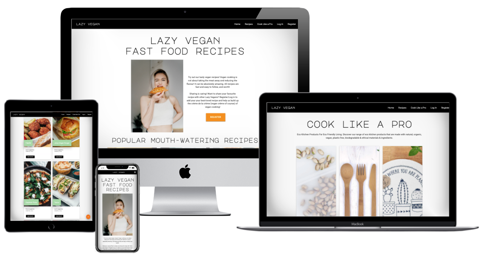
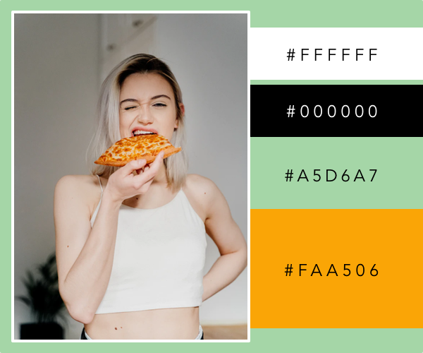
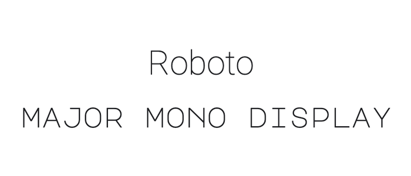
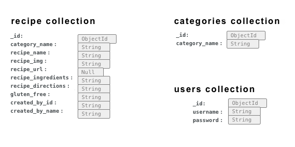
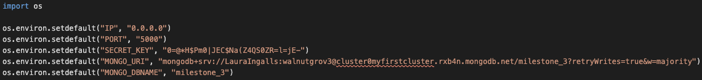
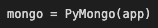
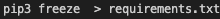
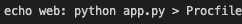

# Lazy Vegan Fast Food Recipes!

 

[View live website here!](###)

[View GitHub repository here!](###)

 

 

Super quick, yummy, vegan recipes for when you're feeling lazy. These easy recipes is done with minimal effort and is ready in no time! 

 

## Table of contents

___

1. [**User Experience**](#ux)
    * Project Goals
    * Business Goals
    * User Goals
    * User Stories
    * Design Choices
        * Color scheme
        * Typography
        * Imagery
        * Icons
    * Wireframes

2. [**Features**](#features)
    * Existing Features
    * Features Left to Implement

3. [**Database Design**](#database-design)

4. [**Technologies Used**](#technologies-used)
    * Languages 
    * Frameworks, Libraries & Programs

5. [**Testing**](#testing)
    * Testing User Stories from User Experience (UX) Section
    * Further Testing
    * Known Bugs

6. [**Deployment**](#deployment)
    * GitHub Pages
    * Forking the GitHub Repository
    * Making a Local Clone

7. [**Credits**](#credits)
    * Code 
    * Content
    * Media
    * Acknowledgements

 

# UX

## Project Goals

 

The purpose of this project is to 

*"...build a full-stack site that allows your users to manage a common dataset about a particular domain"* using HTML, CSS, JavaScript, Python+Flask, MongoDB and possible additional libraries and external APIs. 

*"Design a front end for a data-driven web application that meets accessibility guidelines, follows the principles of UX design, meets its given purpose and provides a set of user interactions"*

## Business Goals

 

Create a web application that allows users to:
    
* Add their own recipes to the website (CREATE)
* Find free recipes online (READ)
* Edit their recipes (UPDATE)
* Delete their recipes (DELETE)
    
The purpose is to get both people who aldready eats vegan and those who don't yet, inspired by the delicious recipes. 

So the site targets a very broad group of people, of all ages, genders, cooking skills (both those who likes to cook but especially thos who is looking for easy recipes) and as well both vegans and those who are not. 
One of the simplest but most important benefits of a broad market is the ability to target a larger number of total prospects with this site. The more total interested visitors you reach out to, the better. 

In addition to the goals above; also to promote a brand of natural, eco-friendly and sustainable kitchen ware that goes hand in hand with Lazy Vegan approach. 

Eventually the recipe database will increase in both recipes and users/visitors. The site offer users to interact by adding their own recipes that makes the user feel like being a part of "the community". The site promotes the vegan life style, showing that it doesn't have to be that hard to eat, even junk food that are vegan. 

## User Goals

 

Find and share recipes. Get inspired by the recipes and get inspired to add/share own recipes at the site which is signals a that a vegan lifestyle doesn't have to be difficult. 

## User Stories

 

* First Time Visitor Goals

    * As a first time visitor, I want to easily understand the main purpose of the site.
    * As a first time visitor, I want the site navigation to be intutive, user friendly and over all ease-of-use.
    * As a first time visitor, I want to be inspired and taken by surprise regarding this new way of thinking about vegan food (easy fast food recipes).
    * As a first time visitor, I want to easily access the recipes.
    * As a first time visitor, I want to be inspired by the site, the recipes and the design. Get a positive feel. 
    * As a first time visitor, I want to be able to create, read, update, delete and search for recipes.
    * As a first time visitor, I want to be able to take part of this community/recipe bank by be able to register. 
    * As a first time visitor, I want to locate some sort of contact information or social media links to be able to follow and get a feel for the credibility of the site. 

 

* Returning Visitor Goals

    * As a returning visitor, I want to be able to easily register if I didn't last time visiting. 
    * As a returning visitor, I want to be able to easily log in, if I registered last time visiting. 
    * As a returning visitor, I want to be able to create, read, update, delete and search for recipes.
    * As a returning visitor, I want to be able to reach out to siteowner for any possible questions.

 

* Frequent Visitor Goals

    * As a frequent visitor, I want to get inspired by newly added recipes. 
    * As a frequent visitor, I want it to be quick and easy to add new recipes.

 

## Design Choices

 

* Color scheme

    The page consists of a white base with black, light green and orange as accent colors. Button at home page is orange to draw the visitors attention to it since it's the first thing they see when entering the site. Main purpose is to get a large base of Lazy Vegans that adds recipes so the ramount of recipes increases.
    
    When hover buttons, they turn to the light green color to tie different elements of the sites together. The chosen colour scheme was specifically selected in order to define the vibe of the page. 

    Green is usually associated with healthy, organic and vegetarian food. The green and white color combination is clean, crisp, and are associated with nature and environmental awareness. The green color has a warm vibe while the supporting soft white lend a modern look. Since green is found commonly in nature, it makes it an excellent choice for recipes sites with healthy and plant based foods. Many Health food stores, Salad bars and Vegan restaurants chooses these kind of colors.
    
    Orange calls to mind feelings of enthusiasm and warmth. Orange has very high visibility, you can use it to draw attention and highlight the most important elements of your design. Orange is very effective for promoting especially food and kitchen products.
    
    

* Typography

    Roboto font is the main font used throughout the site with Major Mono Display used to headers. Roboto has a mechanical skeleton and the forms are largely geometric. At the same time, the font features friendly and open curves. It's subtle and it doesn´t take any attention away from the content. This makes Roboto a more natural reading rhythm more commonly found in humanist and serif types. 
    
    Major Mono Display is a monospaced geometric sans serif all-uppercase typeface with a playful attitude. This font is a great choice for playful web typography.. Major Mono Display is a clean but charming and unconventional font that also gives the site a relaxed vibe. The combination of these fonts represents both the healthy, vegan side aswell as the relaxed fast food approach. 

    

* Imagery

    Images and the choices of the images is an important component of this site. I chose contemporary, clean images that appeal most audiences. I have four appealing images at the home page to catch the visitors intrerest right away. I use lot of space around images and content to get the visitor an uncluttered and comfortable browsing experience on all device sizes.

* Icons

    All icons (except the one at the tab which is taken from FreeIcons) used are taken from Font Awsome. I have decided to choose icons for the search button, back to top icon, add buttons, log in button, log out button, cancel button, edit button, register button and social media link (Pinterest) in the footer.

 

## Wireframes 

* [Mobile](https://github.com/jennymalmoe/MSP3/blob/main/wireframes/mobile/wireframes_mobile.pdf) 
* [Tablet](https://github.com/jennymalmoe/MSP3/blob/main/wireframes/tablet/wireframes_tablet.pdf)
* [Desktop](https://github.com/jennymalmoe/MSP3/blob/main/wireframes/desktop/wireframes_desktop.pdf)

 

**Post wireframes design changes:**
While the project relied on these wireframes, there are some differences between the wireframes and the final product. 

* Only register button at Home page and no Log In button.
* I choose to only have one social media channel in footer.
* There is no qoute at the bottom of Home page.
* There are no category buttons at Recipe page.
* Recipe cards at Recipe page has a little bit of different styling than in wireframes. 
* No user information in Profile page. 
* Slightly different layout of the recipes after you clicked to view recipe.

# Features

## Existing Features 

 

Every page of the website features a consistently responsive and intuitive layout and navigational system:

**General features**
* Fixed navbar to be seen at all times.
* Footer on all pages.  
* Responsive site on all devices. 
* Fixed on top of the page on all device sizes.
* Shown as a collapsible navbar (hamburger button) triggered at tablets and mobile devices. 
* Search bar allowing visitors to search for recipes. 
* Visitor can contact Lazy Vegan (mail) by clicking at mail address in footer.
* Visitor/Users can follow Lazy Vegan at Pinterest by clicking Pinterest icon.

**Home Page**
* Features a modern design and eye catching image.
* Visitor/Users can get redirected directly to Recipe page. 
* Registration, visitors allows to register.

**Recipe Page**
* Visitors/Users can search for recipes.
* Features a clean search bar for user to search. 
* Visitors/Users can read recipes.
* Visitors/Users can see who added the recipes.

**Shop Page**
* Kitchen ware is presented and visitor can get inspired by the products and get redirected to the site and buy the products.
* Features some examples of products that goes hand in hand with the rest of the sites purpose; eco and vegan friendly kitchen ware.

**Log In Page**
* Log In is possible after registered.
* User gets a success message when loged in to verify user stated right username and password.
* Features a clean log in form for user to log in.
* Users can be redirected directly to Registration Page if not already registered.
* Users can contact Lazy Vegan (mail).
* User get redirected to Profile Page after login in.

**Log Out**
* User get redirected to Log In Page after login in.
* User gets a success message when loged out to verify user loged out.
* Features a clean log out form for user to log out.

**Register Page**
* Registration, visiters allows to register.
* User gets a "welcome message" at Profile page when registered to verify user registration. 
* Features a clean registration form for visitor to sign up.
* Visitor can be redirected directly to Log In Page if already registered.
* Visitor can contact Lazy Vegan (mail).
* User get redirected to Profile Page after registered.

**Profile Page**
* Users can see own added recipes. 
* If user hasn't added any recipes, a suggestion to do that is presented along with a button to redirect directly to Add Recipe page. 
* Users can edit, delete and add recipes. 

**Add Recipes**
* User can choose between four categories, add a recipe name, image url, choose to use default image insted of own image, see a preview of that image url, add ingredients and directions for the recipe, tell if it is a gluten free recipe or not.
* User gets a success message when added a recipe to verify adding recipe completed.
* Features a clean form for user to add a recipe.
* Done adding recipe get redirected to Recipe Page.

**Edit Recipe**
* Edit one or more sections in the recipe (only recipes added by user her self).
* User gets a success message when edited a recipe to verify updated recipe completed.
* Delete a recipe (only recipes added by user her self).
* Features a clean form for user to edit, delete or cancel.
* Each section is pre-filled with data provided when adding recipe in first place. 
* Done editing recipe get redirected to Recipe Page.

**Delete Recipe**
* User gets a success message when deleting a recipe to verify recipe now deleted. 

 

## Features left to implement
* Email notification functionality for users to be alerted when a new recipe is added.
* Be able to search through categories, kind of food (italian, mexican etc).
* Ability to reset an account password.
* User profile picture functionality, allowing users to add profile pictures.
* Allowing/Enabling users to comment the recipes.
* Present more information about the benefits for being a vegan and living a vegan lifestyle.
* Easier to get contacted by business partners regarding any collaboration, business deals and sponsorship.
* Get more contact information about the registered users to be able to reach out (newsletters, offers etc).
* Some kind of chatt/forum for the community to grow. 

 

# Database

 

MongoDB Atlas is used as database backend for storing user and recipes details. There are three collections; 

 

## Database schema

 

# Technologies Used

 

**Languages, Frameworks and Libraries**

 

* [BSON](https://bsonspec.org/) - bson.objectid is a required dependency for MongoDB management system.
* [CSS](https://developer.mozilla.org/en-US/docs/Web/CSS) - used to create the styling throughout the site.
* [Google fonts](https://fonts.google.com/) - used to import fonts.
* [HTML](https://developer.mozilla.org/en-US/docs/Web/HTML) - used to create the site structure.
* [Flask](https://flask.palletsprojects.com/en/1.1.x/) - framework used to create and populate the templates.
* [JavaScript](https://developer.mozilla.org/en-US/docs/Web/JavaScript) - used for the sidenav, back-to-top button, image preview.
* [Jinja](https://jinja.palletsprojects.com/en/3.0.x/) - Jinja templating language was used to simplify and display backend data in html.
* [jQuery](https://jquery.com/) - used to activate the Materialize functionality.
* [Materialize](https://materializecss.com/) - library used for styling and responsiveness.
* [PyMongo](https://pypi.org/project/pymongo/) - flask_pymongo was used for interacting with MongoDB database from Python.
* [Python](https://www.python.org/) - used to write the logic that operates the site.
* [Werkzeug](https://werkzeug.palletsprojects.com/en/2.0.x/) - used for password hashing and authentication.
    
 

**Tools and Editors**

 

* [Am I Responsive](http://ami.responsivedesign.is/) - used to validate the responsiveness. 
* [Balsamiq](https://balsamiq.com/) - used to create the wireframes.
* [Chrome DevTools](https://developer.chrome.com/docs/devtools/)  - used Lighthouse to check sites performance and the dev tool to check responsiveness.
* [Designwizard](https://www.designwizard.com/) - used for inspirations regarding color combinations.
* [Font-Awesome](https://fontawesome.com/) - used for icons.
* [FreeIcons](https://freeicons.io/) - used for icon in tab.
* [Git](https://git-scm.com/) - used for version control to commit to Git and push to Heroku.
* [GitHub](https://github.com/) - used to store the projects code after being pushed from Git.
* [Gitpod](https://gitpod.io/) - IDE used for development.
* [Heroku](https://www.heroku.com/home) - cloud platform used to deploy application.
* [Jinja](https://jinja.palletsprojects.com/en/3.0.x/) - Jinja templating language was used to simplify and display backend data in html.
* [JSHint](https://jshint.com/) - used to test JS code to ensure there were no errors.
* [Unsplash](https://unsplash.com/) - Images used were obtained from Unsplash.
* [PEP8](https://www.python.org/dev/peps/pep-0008/) - Used as style guide for Python code.
* [PEP8online](http://pep8online.com/) - Used to check code for PEP8 requirements
* [Pixelmator](https://www.pixelmator.com/mac/) - used to resize images.
* [Postimages](https://postimages.org/) - used to create url for images. 
* [RandomKeygen](https://randomkeygen.com/) - used to generate secure password to Secret Key. 
* [TechSini](https://techsini.com/) - mockup generator used for preview of the  website.
* [Visual Studio Code](https://code.visualstudio.com/) - IDE used for code editing.
* [W3C Validator](https://validator.w3.org/) - used to test HTML code to ensure there were no errors.
* [W3C Validator CSS](https://validator.w3.org/) - used to test CSS code to ensure there were no errors.

 

### Database Management

 

* [MongoDB](https://www.mongodb.com/3) - used for database functionality.
* [MongoDB Atlas](https://www.mongodb.com/cloud/atlas) - used to host the database.

 

# Testing
See separate [testing.md file](documentation_testing/testing.md)

 

# Deployment

 

Requirements to deploy:

* An IDE (Gitpod)
* Python3 (In order to to run the application and use Flask)
* PIP3 (To install all application imports, such as Flask and OS)
* A template folder (To link app routes)
* A database (MongoDB Atlas)

 

## MongoDB Configuration
1. Login to your MongoDB Account.
2. From Clusters tab, click on Connect.
3. Select Connect to your application.
4. Select Python as Driver and choose Version 3.6 or later
5. Create a new env.py file in your project, paste and save the connection link and variables.

6. Create an instance of PyMongo

 

## Heroku Deployment
1. Before deploying your project create a requirements.txt file by running the following command in the CLI;

    

2. Create a Procfile file by running the following command in the CLI;

    

3. git add and git commit the new requirements and Procfile and then git push the project to GitHub.
3. Log in to [Heroku](https://dashboard.heroku.com/apps).
4. Select "New" on your dashboard and then select "Create new app".
5. Choose a name for your application, select your region, and then click "Create app".
6. From the app dashboard, navigate to "Deploy" tab.
7. From Deployment method select "Github" and confirm the linking of the Heroku app by clicking "Search" then select your repository name.
8. Once you select your repository, click on "Connect".
9. After you connected to your repository, click on "Settings" tab on your app dashboard, and click on "Reveal Config Vars" and add your configuration variables to Heroku.
10. Navigate to "Deploy" tab, and from Manual deploy choose your master branch, and click "Deploy Branch".
11. After you deploy your branch "Enable Automatic Deploys".
12. Site is successfully deployed, any futher changes will automatically be updated everytime they are commited and pushed on Github.

 

## How to run this project locally
1. Install the Gitpod Browser Extentions for Chrome.
2. After installation, restart the browser. 
3. Log in to Gitpod with your gitpod account.
4. Navigate to the Project GitHub repository.
5. Click the green "Gitpod" button in the top right corner of the repository.
6. This triggers a new gitpod workspace to be created from the code in GitHub where you can work locally.

### To work on the project code within a local IDE 
1. Log in to GitHub and locate the GitHub Repository.
2. Under the repository name, click "Clone or download".
3. In the clone with HTTPs section, copy the clone URL for the repository.
4. Open the terminal in your local IDE.
5. Change the current working directory to the location where you want the cloned directory to be made.
6. Type **git clone**, and then paste the URL you copied in Step 3.
7. Press Enter. Your local clone will be created.

 

# Credits
* My mentor Oluwaseun Owonikoko for helpfull feedback througout the project.
* Code Institute tutor support.
* Fellow students on Slack for a helping hand when I've got stuck.
* Google!

Site for educational purposes only.

