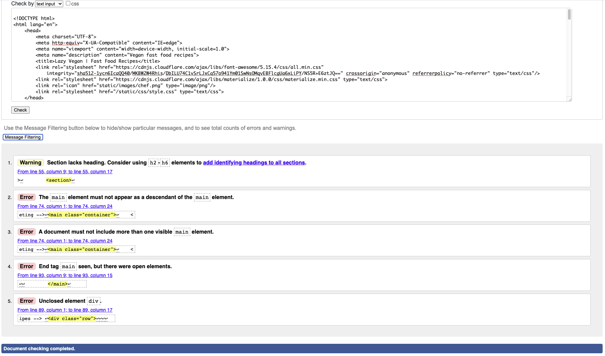
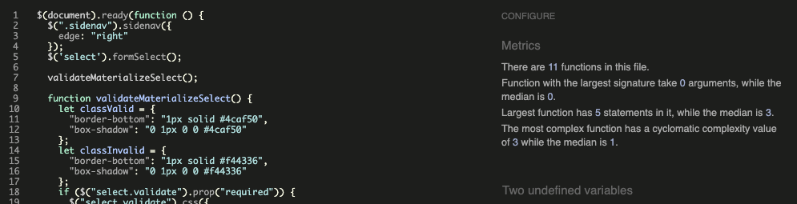
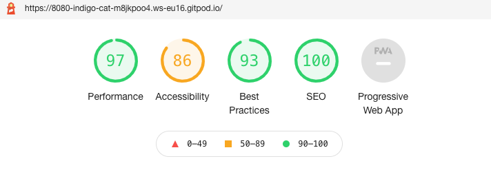
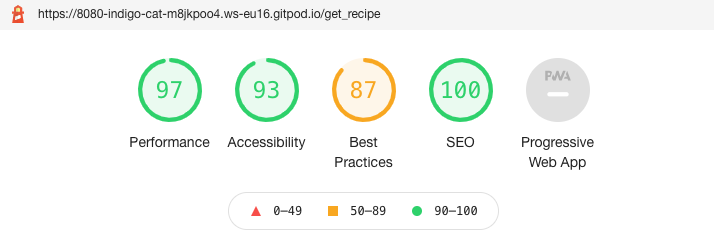
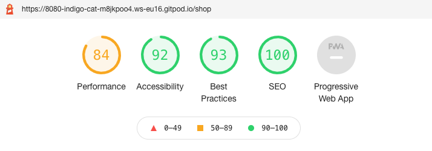
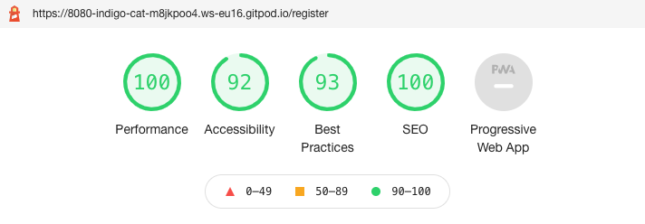
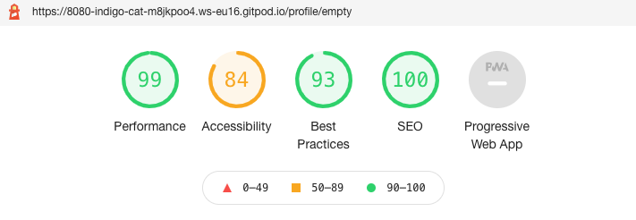

# Testing 

## Lazy Vegan Fast Food Recipes!

 

[View live website here!](https://flask-milestone-3-project.herokuapp.com/home)

[View README.md here!](https://github.com/jennymalmoe/MSP3/blob/main/README.md)

 

## Contents Table

1. [**Testing User Stories from UX Design Section**](#testing-user-stories-from-ux-design-section)
    - **First Time Visitor Goals**
    - **Returning Visitor Goals**
    - **Frequent User Goals**

2. [**Testing**](#testing)
  * Automated Testing
      - **W3C Markup Validator Results**
      - **W3C CSS Validator Results**
      - **JSHint Results**
      - **PEP8 Online Validator Results**
  * Manual Testing

3. [**Bugs Discovered**](#bugs-discovered)

 

# Testing User Stories from UX Design Section

 

### First Time Visitor Goals

 

* As a first time visitor, I want to easily understand the main purpose of the site.
    - When visitor enters website, the visitors is welcomed by a clean site with lots of space and a really clear header and a intro text that cleray states the purpose of the site. 

 

* As a first time visitor, I want the site navigation to be intutive, user friendly and over all ease-of-use.
    - Sites has a fixed navbar that is present wherever page (even if visitor scrolls down) the visitor is looking at. The navbar is clearly displaying all pages/links for a new user to make navigation through the site easy and effortless. 

 

* As a first time visitor, I want to be inspired and taken by surprise regarding this new way of thinking about vegan food (easy fast food recipes).
    - Already at the Home page the visitors can be inspired by the sites easy recipes by the into text and by the recipe cards of three popular recipes. 

 

* As a first time visitor, I want to easily access the recipes.
    - Home page presents three popular recipes with links that redirect visitor directly to Recipe page. Visitor can also click on Recipe page in navbar and get redirected to Recipe page. 

 

* As a first time visitor, I want to be inspired by the site, the recipes and the design. Get a positive feel. 
    - By the clean, fresh look in Home page the vistor can det inspired and curios about the site, since intro-tex and poopular recipes in Home page is presented.

 

* As a first time visitor, I want to be able to create, read, update, delete and search for recipes.
    - There is a register button at first sight in Home page thar redirects visitor to Register page. Intro text in Home page states that to create/add a recipe, visitor need to register. Visitor can read recipes in Home page and click on Recipe in navbar for access all recipes. When visitor created a recipe, the visitor is allowed to edit and delete same recipe. 

 

* As a first time visitor, I want to be able to take part of this community/recipe bank by be able to register. 
    - There is a register button right away in Home page thar redirects visitor to Register page. Visitor can also click on Register in navbar for accessing the Regitration Page.

 

* As a first time visitor, I want to locate some sort of contact information or social media links to be able to follow and get a feel for the credibility of the site. 
    - There is contact email in Log In page, Log Out page and Register page. There is a Pinterest icon in footer througout all pages. 

 

### Returning Visitor Goals

 

* As a returning visitor, I want to be able to easily register if I didn't last time visiting. 
    -There is a register button right away in Home page thar redirects visitor to Register page. Visitor can also click on Register in navbar for accessing the Regitration Page.

 

* As a returning visitor, I want to be able to easily log in, if I registered last time visiting. 
    - Visitor can click on Log In link in navbar and get redirected to Log In page. 

 

* As a returning visitor, I want to be able to create, read, update, delete and search for recipes.
    - There is a register button at first sight in Home page thar redirects visitor to Register page. Intro text in Home page states that to create/add a recipe, visitor need to register. Visitor can read recipes in Home page and click on Recipe in navbar for access all recipes. When visitor created a recipe, the visitor is allowed to edit and delete same recipe. 

 

* As a returning visitor, I want to be able to reach out to siteowner for any possible questions.
    - There is contact email in Log In page, Log Out page and Register page.

 

### Frequent Visitor Goals

 

* As a frequent visitor, I want to get inspired by newly added recipes. 
    - Recipe page is continuously updated with newly added recipes bu users and siteowner. 

 

* As a frequent visitor, I want it to be quick and easy to add new recipes.
    - There is a register button at first sight in Home page thar redirects visitor to Register page. Intro text in Home page states that to create/add a recipe, visitor need to register. Visitor can read recipes in Home page and click on Recipe in navbar for access all recipes. When visitor created a recipe, the visitor is allowed to edit and delete same recipe. 

 

# Testing

 

### Automated Testing

 

To make make it easier to validate html code, since using jinja templating language throughout all pages, which results in errors in online validators. I copied the code from "View page source" and pasted it in "The W3C Markup Validation". Still one error keept showing at every page (due to jinja templating language) when run in validator. The section showed in page source because of the div and h4 (I guess). This also happend (due to jinja templating) when validated profile page (see screenshots below). 

As seen there where no other errors.

 

Returning error:

Profile Page errors due to jinja template language as well:
 

 

<b>Click here for HTML Validator results</b>

- __Home__

  

- __Recipe__

  

- __Shop__

  

- __Log In__

  

- __Register__

  

- __Add Recipes__

  

- __Profile__

  

- __Edit Recipe__

  

- __View Recipe__

  

<b>Click here for CSS Validator results</b>

- __CSS Validator Results__

  

<b>Click here for JSHint results</b>

- __JSHint Results__

  

<b>Click here for PEP8 Online results</b>

- __PEP8 Online Results__

  

 

 

### Manual Testing

 

#### Responsive Design - PASS

 - All pages were tested locally, and on Heroku using Chrome, Firefox, IE, and Safari. 
 - All pages tested for responsiveness in different device using Google Chrome Developer Tools and Am I Responsive
   - Desktop 
   - iPhone 5/6/7/8/X 
   - iPad 1/2/3/Pro 
   - Galaxy Android phones
- All the pages were also tested manually using;
  - iPhone 5s/6s/8/X/XS/11/
  - Samsung Galaxy S8/Note 10+
  - iPad Air 2 
  - iPad Pro 3
  
 

### Functionality Testing

 
  
#### Navbar - PASS
  
- All links are working and redirect the user to where they want to go next.
- Hamburger bar at smaller devices works.
- Logo works as link to home page.
  
#### Home Page - PASS
  
- Registration button works.
- All buttons on "popular recipes" works.

#### Recipe Page - PASS 
  
- Search bar is working, and lets user search through recipe name. If user input match any recipe, the recipe in question shows.
- Search button works and starts a search function. 
- Reset button works.
- All recipe cards buttons "View Recipe" works and get the visitor to the recipe visitor wanted to view. 

#### Shop Page - PASS
  
  - All product cards buttons "Buy Now" works and redirects visitor to the product in question page in a new tab outside Lazy Vegan website. 

#### Login - PASS
  
- Form inputs works. 
- Form validations work as expected and gives feedback regarding unmatched format, incorrect username, incorrect password, or if user doesn't exist in the database.
- Log In button works as expected and submits data successfully, and redirects user to Profile page.
- Register account link works.
- Contact email address-link works.

#### Profile - PASS
  
- All recipes added by current user are displayed in cards as it should.
- All recipe cards buttons "View Recipe" (users own added recipes) works and get the visitor to the recipe visitor wanted to view.
- If current user hasn't added any recipes, "Add a Recipe" button shows along with encouraging text.
- "Add a Recipe" button shown when user hasn't added any recipes works.
- Edit button on recipe card works and allows user to easily edit their recipe. 
- Edit button redirects to edit page where all prior added conten is pre-filled as it should.
- All editing works fine and generates a success message. 
- Cancel button works as expected.
- Delete button works as expected and deletes the recipe and generates a success message.
- Back to Recipe button works. 

#### Add Recipe - PASS
  
- All form inputs works, and stores the data in the database.
- Choose category dropdown works.
- Min and max length for text input works.
- Image preview works and show image before uploadadding the recipe. Preview image function on the form is responsive and all images fits all devices sizes.
- Gluten Free switch works (on/off).
- Add Recipe button works and submits data and generate a successfull message.
- The added recipe ends up in Recipe Page as it should.  
  
#### Register - PASS
  
- Form inputs works. 
- Form validations work as expected and gives feedback regarding unmatched format, incorrect username, incorrect password, or if user doesn't exist in the database.
- Register button works as expected and submits data successfully, and redirects user to Profile page.
- Log In link works.
- Contact email address-link works.
  
#### Logout - PASS
  
- Logout functionality works = logs out user, and removes session cookies.
    
#### Footer - PASS
  
- Footer is present on all pages. 
- Social link (Pinterest) in footer works as expected, and open Pinterest in new tab. 
- Email address links to mail function. 
- Back to top button works througout all pages.
  
  
### Security Testing
  
- Tested against users seeing Edit and Delete buttons at other users added Recipes. **PASS**
- Tested Add Recipe page, not to choose category or fill the inputs fields with less text than min length. As well as for the max lenght or skip one or more input fields. **PASS**
- Tested register with a taken username. **PASS**
- Tested register with unallowed character and to few characters. **PASS**
  
### Google Lighthouse Testing 
  
  - All pages were tested using Google's Lighthouse.
  
  

<b>Click here for Lighthouse results</b>

  
  - __Homepage__

  

  - __Recipes__

  

  
  - __Shop__

  

  - __Log In__

  

  - __Register__

  

  - __Profile__

  

  - __Add Recipe__

  

  - __Edit Recipe__

  

 

# Bugs Discovered

**Solved Bugs**

The developer ran into several issues during the development of the site. These are the most distinguishing ones, along with the solution:

* Image URL didn't show when edited a recipe. It turned out that there needed to be placeholder and value in the input tag for the image. When *value="{{ recipe.recipe_img }}"* and *placeholder="{{ recipe.recipe_img }}"* was added, image URL showed as expected as pre-filled content in edit form. 
* Intro text and image in Home page had col-12 added to their div's. They were removed and replaced by col s12 as use Materialize design and not Bootstrap.
* Register button in Home page wasn't centered as expected in medium and small screensizes. This was solved adding a new main class in stylesheet:" .search-section". Then added display:flex and flex-direction:row to that class, as well as added display:flex and flex-direction: row in the media query for small devices. 

 

#### __[Back to Contents Table](#contents-table)__ 